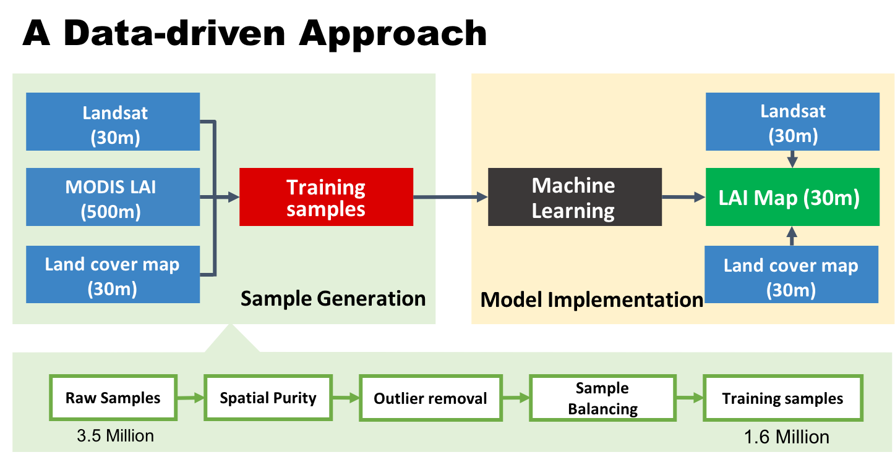
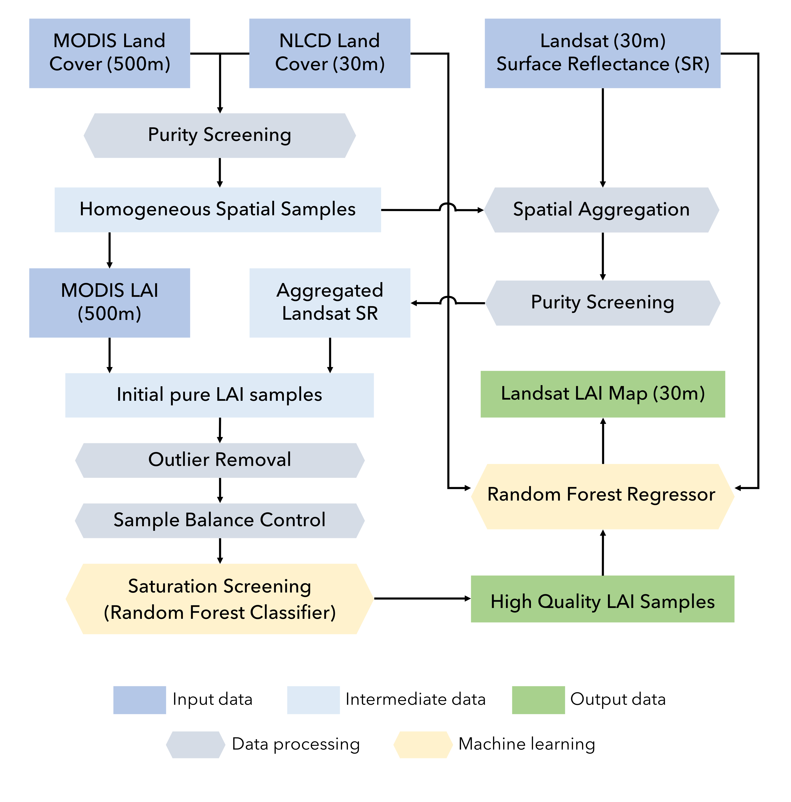
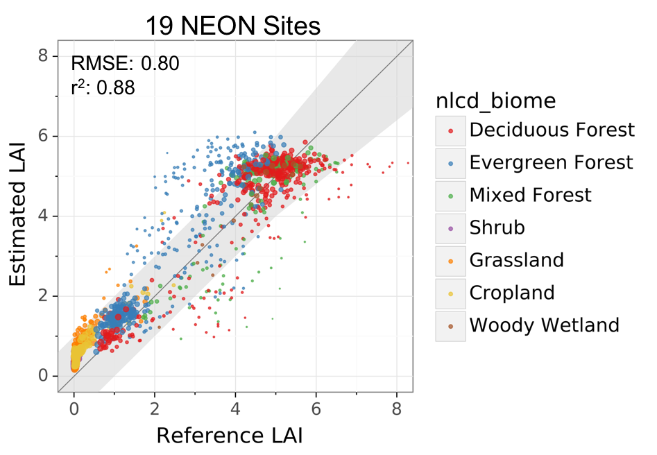
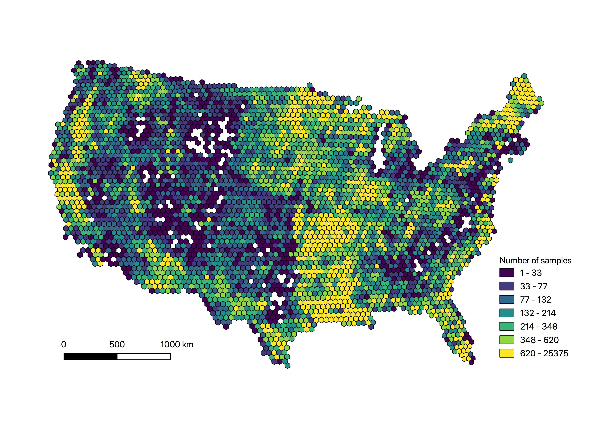

# Landsat LAI project
This repository provides code and data to generate Leaf Area Index (LAI) images at 30-meter resolutions from Landsat data using Google Earth Engine. Using machine learning and a comprehensive training set derived from MODIS LAI/Fpar products ([MCD15A2H v006](https://lpdaac.usgs.gov/products/mcd15a2hv006/)), Landsat Collection 1 Tier 1 [surface reflectance](https://www.usgs.gov/core-science-systems/nli/landsat/landsat-collection-1?qt-science_support_page_related_con=1#qt-science_support_page_related_con), and National Land Cover Dataset ([NLCD](https://www.mrlc.gov)), this approach allows fast generation of LAI maps for any Landsat 5, 7, 8 image using Google Earth Engine. The Landsat LAI estimation is highly consistent with the state-of-the-art MODIS product, enabling downstream applications that operate across scales.

*NOTE: The current version works only within the Contiguous US (CONUS), where all training samples were generated. The algorithm is highly adpatable to other areas and a global version is in the works.*

Citation:

Kang et al. (2021) |  citation here
------------ | -------------  

## Methodology

The methodology has two general steps: 1) sample generation; 2) model implementation. In the first step, we extracted millions of samples from the MODIS LAI, Landsat surface reflectance, and NLCD data from 2006 to 2018 within CONUS. The samples were stratified by Landsat sensor (Landsat 5 TM, Landsat 7 ETM, and Landsat 8 OLI), biome types (8 biomes), and saturation status from the MODIS LAI algorithm. Each sample has a MODIS LAI value, corresponding surface reflectance values from Landsat (aggregated within the MODIS pixel), a biome type from the NLCD, and other auxiliary information (like geographic location and solar illumination angles). To avoid scale effects, we use only pixels that are spatially homogeneous, which means that the MODIS pixel area (500-m) has a single biome or land cover type from NLCD and the Landsat surface reflectance (30-m) variation is very small. There are additional outlier removal and balancing processes to ensure sample quality.  

In the second step, we train seperate random forest (RF) models for each biome type and each Landsat sensor. This allows us to overcome the memory limit of Earth Engine and use more samples to ensure accuracy. The RF models are trained to predict LAI using surface reflectance and other information from the Landsat images. The features include surface reflectance from red, green, nir, and swir1 bands, Normalized Difference Vegetation Index (NDVI), Normalized Difference Water Index (NDWI), solar zenith angle, solar azimuth angle, and geographic cooridantes. When running on Google Earth Engine, the code will first load the training dataset stored as an EE asset, train random forest models, and then apply to every pixel of the Landsat surface reflectance image. 

## Validation
We validated this approach in 19 NEON sites and 8 independent study sites. The overall RMSE across the 19 NEON sites is 0.8, and R2 is 0.88. The uncertainty in LAI varies by biome and site. The RMSE ranges between 0.5 and 0.9 for the 8 independent sites. Below is the result from the NEON sites. Please be cautious that both satellite estimated and ground measured LAI are always associated with random and bias errors.

## Training data

The entire training set with 1.6 million training samples is available in the ["data"]() folder, along with the convex hull data used to generate the the QA flags. 

## Code
Python and javascript scripts to export LAI maps for chosen Landsat scene (path/row) over certain time periods. Please find the scripts in the ["standalones"]() folder. The python script is good for batch export of LAI images to a EE asset directory.

## Output format
The output image contains two bands: a "LAI" band in signed int16 scaled by 100 and a "QA" band with quality flags of input and output range.

    QA is coded in a byte-size band using the least significant 3 bits
    Bit 0 - Input
         0: Input within range
         1: Input out-of-range
    Bit 1 - Output (LAI)
         0: LAI within range (0-8)
         1: LAI out-of-range
    Bit 2 - Biome
         0: Vegetation (from NLCD scheme)
         1: Non-vegetation (from NLCD scheme)

## References
Kang et al. (2021) |  citation here
------------ | -------------  
Gao et al. (2012) | Gao, F., Anderson, M.C., Kustas, W.P., Wang, Y., 2012. Simple method for retrieving leaf area index from Landsat using MODIS leaf area index products as reference. J. Appl. Remote Sens. 6, 063554. doi:10.1117/1.JRS.6.063554
Gao et al. (2014) | Gao, F., Anderson, M.C., Kustas, W.P., Houborg, R., 2014. Retrieving Leaf Area Index From Landsat Using MODIS LAI Products and Field Measurements. IEEE Geosci. Remote Sens. Lett. 11, 773–777. doi:10.1109/LGRS.2013.2278782

## Acknowledgement

